<div align="center">

<picture>
  <source media="(prefers-color-scheme: dark)" srcset=".github/readme/sr-forge-assistant-dark.svg">
  <source media="(prefers-color-scheme: light)" srcset=".github/readme/sr-forge-assistant-light.svg">
  
</picture>

[](https://plugins.jetbrains.com/plugin/30334-sr-forge-assistant)
[](https://plugins.jetbrains.com/plugin/30334-sr-forge-assistant)
[](https://plugins.jetbrains.com/plugin/30334-sr-forge-assistant)
[](https://plugins.jetbrains.com/plugin/30334-sr-forge-assistant)
[](https://kotlinlang.org)
[](https://plugins.jetbrains.com/plugin/30334-sr-forge-assistant)
[](https://plugins.jetbrains.com/plugin/30334-sr-forge-assistant)
[](https://plugins.jetbrains.com/plugin/30334-sr-forge-assistant)

</div>

---

[SR-Forge](https://gitlab.com/tarasiewicztomasz/sr-forge) is a Python framework for building super-resolution and image restoration pipelines through YAML configuration files. Instead of writing boilerplate training scripts, you declare datasets, transforms, models, and training loops as nested YAML nodes with `_target:` class references, `params:` mappings, and `${...}` interpolations that wire everything together.

**SR-Forge Assistant** brings first-class IDE support to these configs. It resolves `_target:` FQNs to real Python classes, autocompletes parameter names from `__init__` signatures, validates references, folds interpolations to their resolved values, lets you probe live dataset pipelines, interactively visualize tensor fields, and inspect tensor variables during debugging &mdash; all without leaving the editor.

---

## Highlights

<table>
<tr>
<td width="50" align="center">:dart:</td>
<td><a href="#dart-target-intelligence"><b>Target Intelligence</b></a><br>Autocomplete, navigate, document, and validate <code>_target:</code> classes and their parameters</td>
</tr>
<tr>
<td align="center">:link:</td>
<td><a href="#link-interpolation-support"><b>Interpolation Support</b></a><br>Complete, fold, validate, and chain method calls on <code>${...}</code> references</td>
</tr>
<tr>
<td align="center">:art:</td>
<td><a href="#art-visual-aids"><b>Visual Aids</b></a><br>Scope highlighting and an editor toolbar for quick actions</td>
</tr>
<tr>
<td align="center">:microscope:</td>
<td><a href="#microscope-pipeline-probe"><b>Pipeline Probe</b></a><br>Run a dataset pipeline on one sample and visualize Entry state at every transform step</td>
</tr>
<tr>
<td align="center">:bar_chart:</td>
<td><a href="#bar_chart-tensor-visualizer"><b>Tensor Visualizer</b></a><br>Interactive visualization of tensor/ndarray fields with per-dimension controls, colormaps, and histogram</td>
</tr>
<tr>
<td align="center">:bug:</td>
<td><a href="#bug-debugger-integration"><b>Debugger Integration</b></a><br>Right-click a tensor variable during debugging to visualize it instantly</td>
</tr>
</table>

---

## :dart: Target Intelligence

> Everything related to `_target:` FQN values and their `params:` mappings.

<details open>
<summary><b><code>_target:</code> FQN Completion</b></summary>

Fuzzy-search Python classes and functions by fully qualified name. A dot (`.`) auto-triggers the popup for the next path segment &mdash; no need to press <kbd>Ctrl</kbd>+<kbd>Space</kbd> repeatedly.

<div align="center">

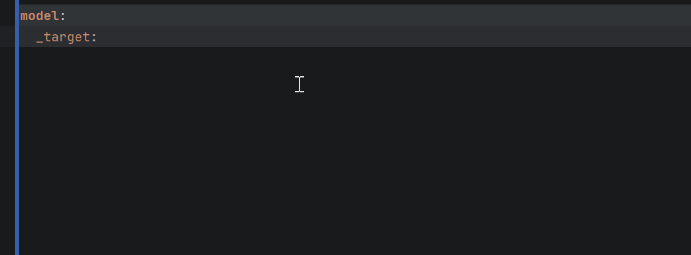
<br><em>Dot-triggered fuzzy search across Python packages</em>

</div>
</details>

<details open>
<summary><b>Parameter Name Completion</b></summary>

Inside a `params:` block, get suggestions from the resolved class's `__init__` signature. Already-present parameters are automatically excluded.

<div align="center">

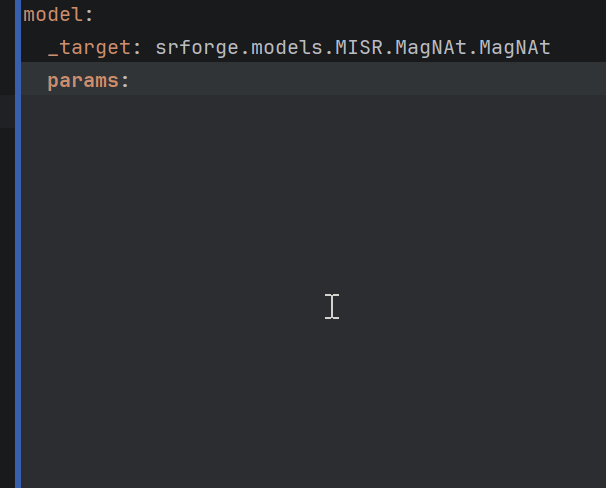
<br><em>Suggestions from the resolved class's __init__ signature</em>

</div>
</details>

<details open>
<summary><b>Go-to-Definition</b></summary>

<kbd>Ctrl</kbd>+<kbd>Click</kbd> (or <kbd>Ctrl</kbd>+<kbd>B</kbd>) on any `_target:` value to jump straight to the Python class or function definition.

<div align="center">

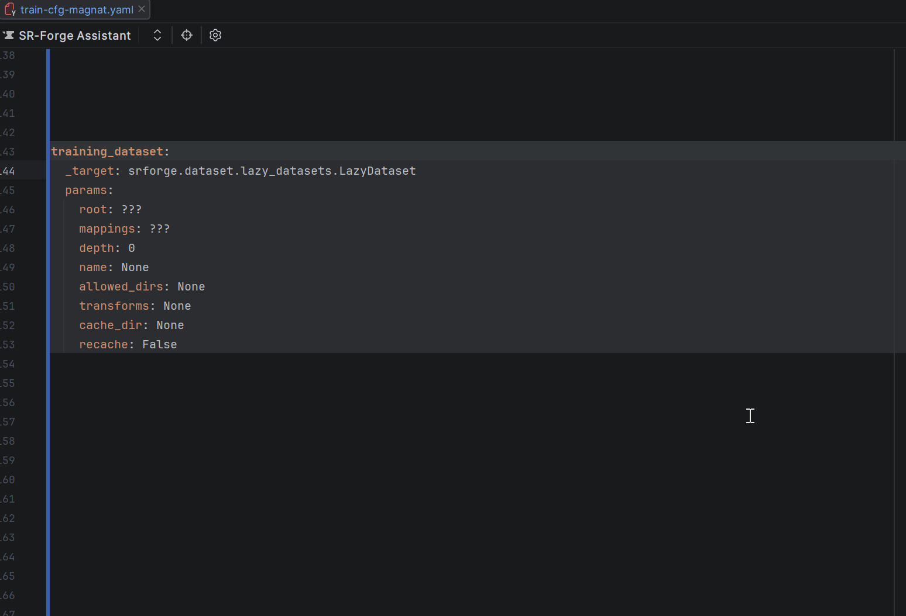
<br><em>Jump straight to the Python source</em>

</div>
</details>

<details open>
<summary><b>Hover Documentation</b></summary>

Hover over `_target:` values to see the class/function docstring and full signature. Hover over parameter keys inside `params:` to see their type, default value, and description.

<div align="center">

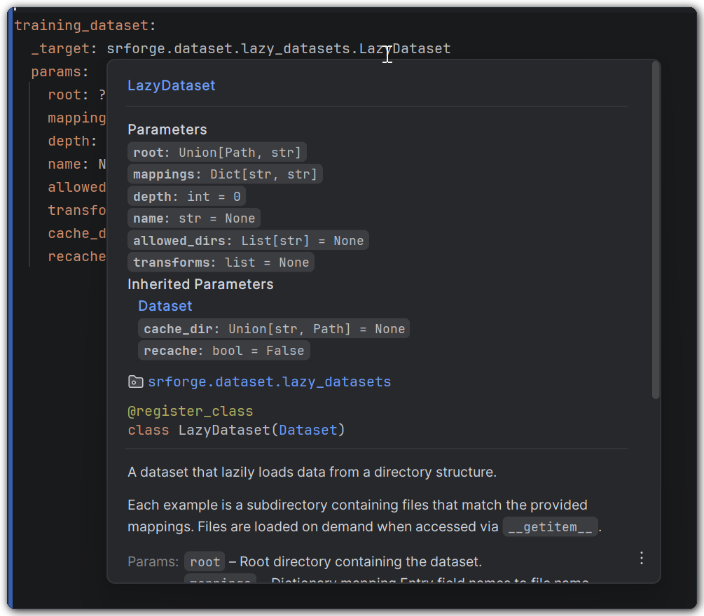
<br><em>Docstring, signature, and parameter info on hover</em>

</div>
</details>

<details open>
<summary><b>Parameter Stub Generation</b></summary>

One-click insertion of missing parameters. Available via:
- **Gutter icon** on `_target:` lines &mdash; click to insert all missing parameter stubs at once
- <kbd>Alt</kbd>+<kbd>Enter</kbd> intention &mdash; *"Generate parameter stubs for \_target"*

Default values are used where available, `null` otherwise.

<div align="center">

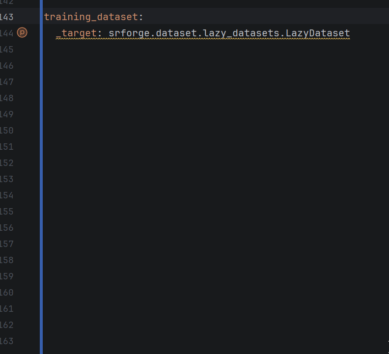
<br><em>One-click insertion of all missing parameters</em>

</div>
</details>

<details open>
<summary><b>Missing Required Parameters Inspection</b></summary>

Warning when required `__init__` parameters (those without defaults) are missing from `params:`. A quick-fix inserts them automatically.

<div align="center">

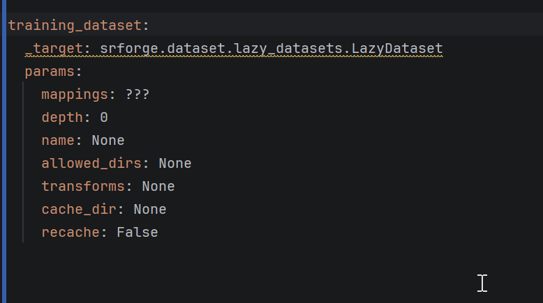
<br><em>Warning with quick-fix for missing required parameters</em>

</div>
</details>

<details open>
<summary><b>Unknown Parameter Name Inspection</b></summary>

Catches typos in parameter keys. Flags unknown names and suggests the closest match by edit distance with a one-click rename quick-fix.

<div align="center">

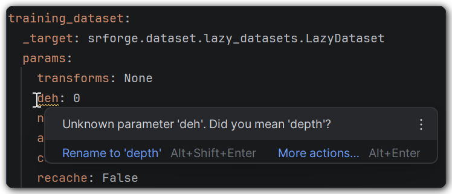
<br><em>Typo detection with closest-match suggestion</em>

</div>
</details>

---

## :link: Interpolation Support

> Completion, folding, validation, and chaining for `${...}` and `${ref:...}` expressions.

<details open>
<summary><b>Path Completion</b></summary>

Segment-by-segment key path completion inside interpolation expressions. At each `.`, the popup shows direct children of the resolved node with value previews and type icons (mapping, sequence, scalar). Supports both dot notation (`list.0.key`) and bracket notation (`list[0].key`).

<div align="center">

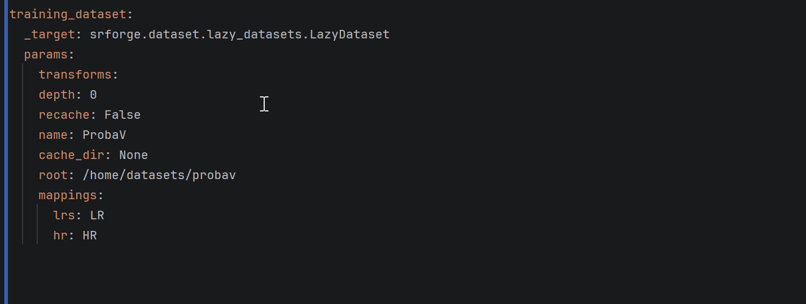
<br><em>Segment-by-segment path completion with value previews</em>

</div>
</details>

<details open>
<summary><b>Code Folding</b></summary>

Interpolation expressions are resolved against the YAML document and displayed as fold placeholders. Folds collapse automatically on file open and can be toggled individually or all at once via the toolbar.

<div align="center">


<br><em>Folds collapse to resolved values, toggle individually or all at once</em>

</div>
</details>

<details open>
<summary><b>Reference Validation</b></summary>

Unresolvable interpolation paths are flagged with an error annotation. Unknown resolver prefixes are also detected.

<div align="center">

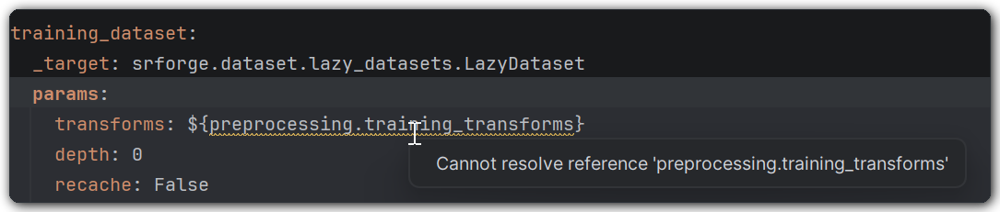
<br><em>Unresolvable paths flagged with error annotations</em>

</div>
</details>

<details open>
<summary><b>Post-Interpolation Method Completion</b></summary>

After an interpolation reference like `${ref:model}`, type `.` to get method and attribute completions from the resolved Python class.

<div align="center">

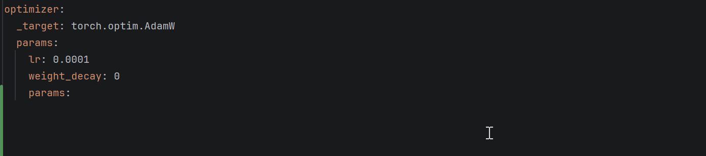
<br><em>Method completions from the resolved Python class</em>

</div>
</details>

---

## :art: Visual Aids

<details open>
<summary><b>Scope Highlighting</b></summary>

The current `_target:` block gets a subtle background shading, and the parent key is rendered in bold &mdash; making it easy to see which block you're editing in deeply nested configs. Colors adapt to light and dark themes.

<div align="center">

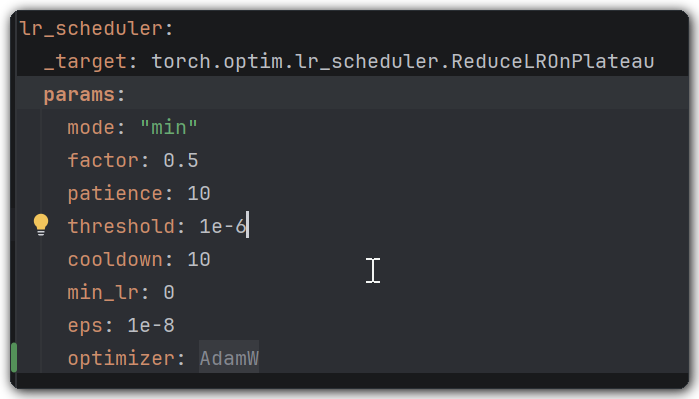
<br><em>Background shading and bold parent key for the active block</em>

</div>
</details>

<details open>
<summary><b>SR-Forge Editor Toolbar</b></summary>

A toolbar appears at the top of YAML files with quick-access buttons:

| Button | Action |
|---|---|
| **Toggle Interpolation Folds** | Collapse or expand all `${...}` folds |
| **Run Pipeline Probe** | Launch the probe for the current file |
| **SR-Forge Settings** | Open the settings panel |

<div align="center">

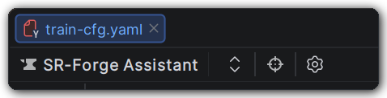
<br><em>Quick-access toolbar for folds, probe, and settings</em>

</div>
</details>

---

## :microscope: Pipeline Probe

> Run the actual dataset pipeline on a single sample and visualize the Entry state at every transform step &mdash; field names, shapes, dtypes, value ranges, and memory sizes &mdash; without leaving the editor.

<div align="center">

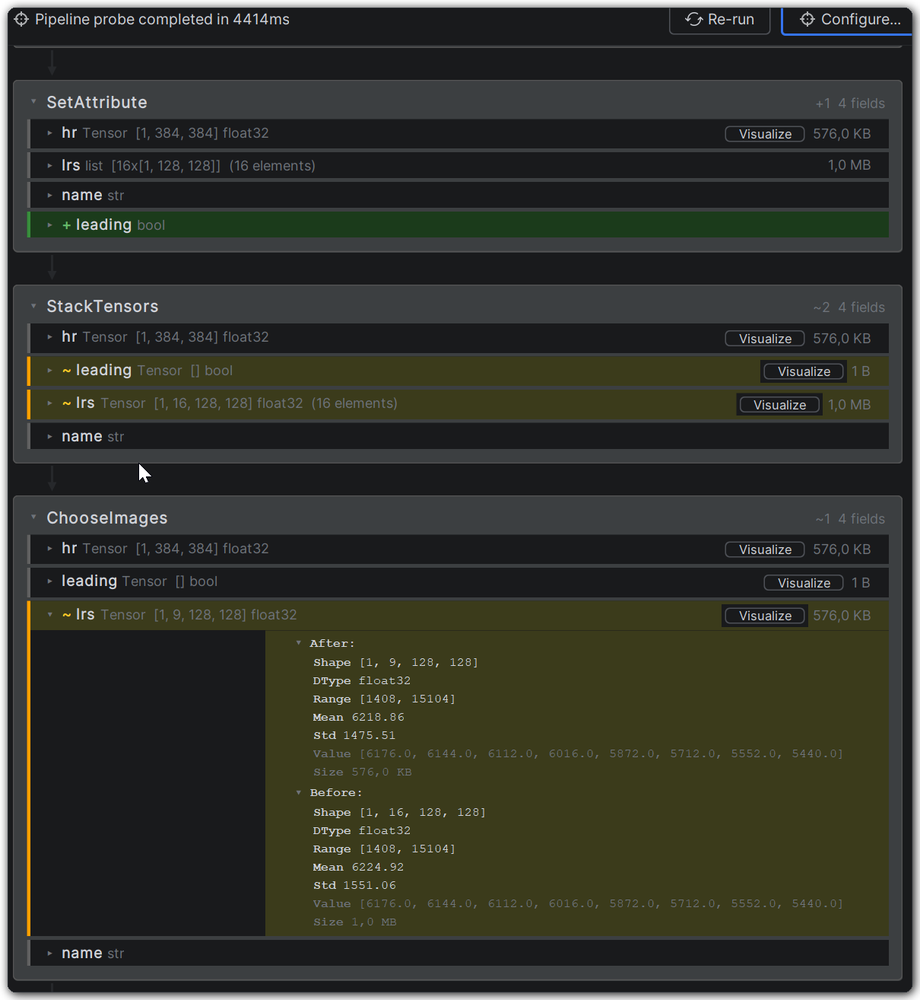
<br><em>Full pipeline flow with transform steps and field details</em>

</div>

<details open>
<summary><b>Usage</b></summary>

1. Open a YAML config file containing dataset definitions with `_target:` values
2. Click **Run Pipeline Probe** on the editor toolbar (or from the Pipeline Probe tool window via **Configure...**)
3. Select a dataset from the dialog. Override data root paths if needed
4. Click **OK** &mdash; the probe runs in the background with a progress indicator
5. Results appear in the **Pipeline Probe** tool window

</details>

<details open>
<summary><b>Results Visualization</b></summary>

Results display as a vertical flow diagram:

- **Blue header block** &mdash; dataset class name and `_target:` FQN
- **Step blocks** &mdash; one per transform, showing all Entry fields after that step
- **Color-coded diffs** &mdash; <span title="added">:green_circle:</span> green (added), <span title="removed">:red_circle:</span> red (removed), <span title="modified">:yellow_circle:</span> yellow (modified), default (unchanged)
- **Field details** &mdash; click a step block to expand its field table (type, shape, dtype, min/max/mean/std, memory size, value preview)
- **Tensor visualization** &mdash; a **"Visualize"** button on tensor/ndarray fields opens the interactive [Tensor Visualizer](#bar_chart-tensor-visualizer)
- **Container drill-down** &mdash; dict and list fields are expandable to inspect nested contents

<div align="center">


<br><em>Color-coded diffs and expandable field tables</em>

</div>
</details>

<details open>
<summary><b>Nested Pipeline Support</b></summary>

For pipelines that wrap other datasets (e.g. `PatchedDataset` wrapping `LazyDataset`), the inner dataset is probed first, then the outer one. Inner results appear above, connected by a "Wrapped by ..." arrow.

<div align="center">

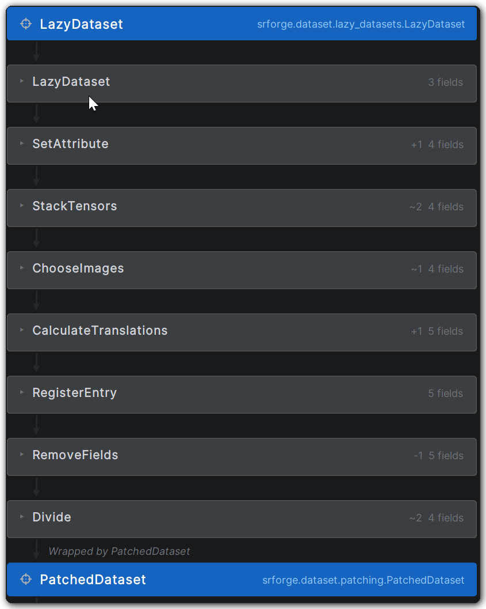
<br><em>Inner dataset probed first, connected by "Wrapped by..." arrow</em>

</div>
</details>

<details open>
<summary><b>Error Handling</b></summary>

If a transform fails mid-pipeline, all successful steps are shown normally, followed by a red error block with the error message and a collapsible traceback. If an inner dataset in a nested pipeline fails, the outer dataset is skipped with a notice.

<div align="center">

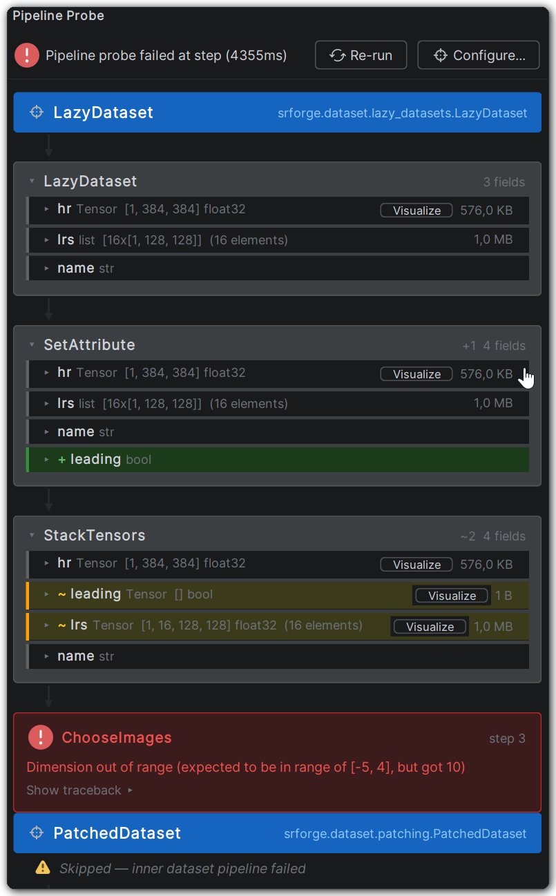
<br><em>Failed transform with error message and collapsible traceback</em>

</div>
</details>

---

## :bar_chart: Tensor Visualizer

> An interactive dialog for visualizing tensor and ndarray fields. Accessible from the **"Visualize"** button on any tensor field in Pipeline Probe results, or by right-clicking a tensor variable during debugging (see [Debugger Integration](#bug-debugger-integration)).

<div align="center">

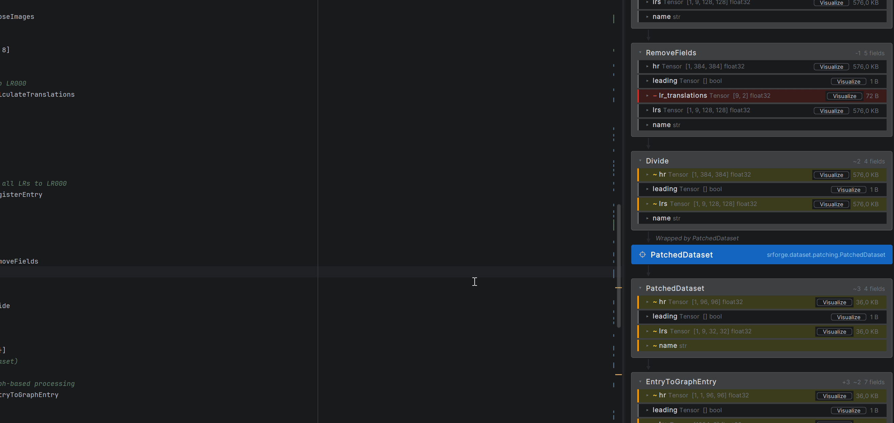
<br><em>Dimension roles, colormaps, channel modes, and pixel inspection</em>

</div>

<details open>
<summary><b>Per-Dimension Role Assignment</b></summary>

Each dimension of the tensor gets a role dropdown:

| Role | Effect |
|---|---|
| **H** | Height axis of the image |
| **W** | Width axis of the image |
| **C** | Channel axis (enables channel mode controls) |
| **Index** | Slice at a specific index (slider control) |
| **Mean / Max / Min / Sum** | Reduce the dimension with the selected operation |

Roles are auto-assigned on open (last dim = W, second-to-last = H, third-to-last = C if size &le; 64, rest = Index) and can be changed freely. H, W, and C are mutually exclusive &mdash; reassigning one automatically unsets it from another dimension.

</details>

<details open>
<summary><b>Display Modes and Colormaps</b></summary>

| Mode | Description |
|---|---|
| **Min-Max** | Normalize to the data range |
| **Histogram Eq** | Histogram equalization |
| **CLAHE** | Contrast-limited adaptive histogram equalization (configurable clip limit and tile size) |
| **Custom Range** | Map a user-defined min/max range |

Colormaps (**gray**, **viridis**, **jet**, **inferno**, **turbo**) are available when the output is single-channel.

</details>

<details open>
<summary><b>Channel Modes</b></summary>

When a **C** dimension is assigned:

| Mode | Description |
|---|---|
| **RGB** | Map first 3 channels to R, G, B |
| **Custom RGB** | Choose which channel indices map to R, G, B |
| **Single Channel** | View one channel at a time (by index) or a reduction (mean, max, min, sum) |

</details>

<details open>
<summary><b>Image Inspection</b></summary>

- **Zoom** &mdash; scroll wheel (zooms toward cursor)
- **Pan** &mdash; click and drag
- **Pixel hover** &mdash; shows raw float values per channel in the sidebar
- **Statistics** &mdash; min, max, mean, std, and shape
- **Histogram** &mdash; configurable bin count (4&ndash;4096)
- **Save PNG** &mdash; export the current visualization

</details>

---

## :bug: Debugger Integration

> Right-click any **PyTorch Tensor** or **NumPy ndarray** variable in the debugger's **Threads & Variables** panel and select **"Visualize Tensor"** to open the same interactive tensor visualizer.

<div align="center">

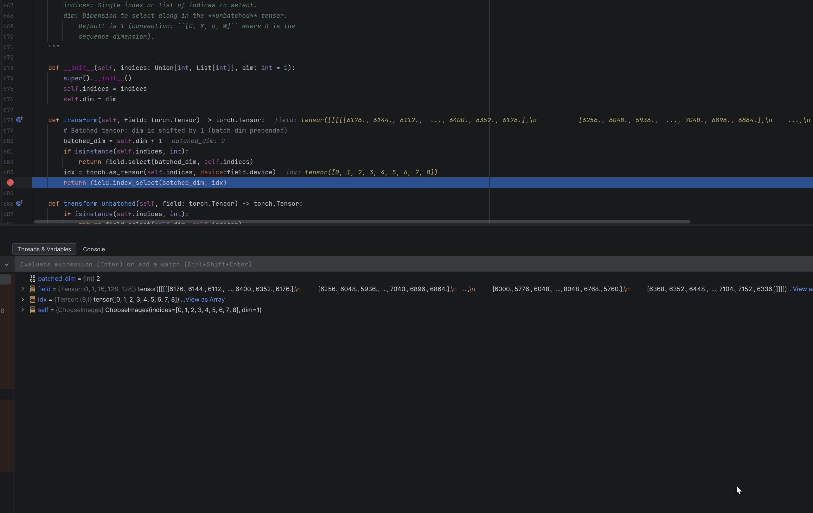
<br><em>Right-click a tensor variable to visualize it instantly</em>

</div>

Works with both the Variables list and Watches. The tensor is saved to a temporary `.npy` file, which is automatically cleaned up when the dialog closes.

Compatible with PyCharm 2024.2+ and PyCharm 2026+.

---

## :gear: Configuration

> Access via <kbd>Settings</kbd> &gt; <kbd>Tools</kbd> &gt; <kbd>SR-Forge Assistant</kbd>

<details>
<summary><b>Features</b></summary>

| Setting | Default | Description |
|---|:---:|---|
| Target completion | On | `_target:` FQN autocomplete |
| Target navigation | On | Go-to-definition on `_target:` values |
| Target documentation | On | Hover docs for `_target:` and params |
| Interpolation completion | On | Path completion inside `${...}` |
| Interpolation folding | On | Code folding for interpolation expressions |
| Parameter stubs | On | Gutter icon and intention for stub generation |

</details>

<details>
<summary><b>Scope Highlighting</b></summary>

| Setting | Default | Description |
|---|:---:|---|
| Block highlighting | On | Background shading for the current `_target:` block |
| Parent key highlighting | On | Highlight the parent key of the current block |
| Parent key font style | Bold | Font style for the highlighted parent key |
| Block color (light/dark) | `#F8FAFF` / `#2C2E33` | Block background color per theme |
| Parent key color (light/dark) | `#EDF2FC` / `#313438` | Parent key background color per theme |

</details>

<details>
<summary><b>Interpolation Folding</b></summary>

| Setting | Default | Description |
|---|:---:|---|
| Fold on file open | On | Auto-collapse interpolations when a file is opened |
| Auto-collapse on caret exit | On | Re-fold an interpolation when the caret leaves it |
| Placeholder max length | 60 | Truncate long fold placeholders at this character count |

</details>

<details>
<summary><b>Pipeline Probe</b></summary>

| Setting | Default | Description |
|---|:---:|---|
| Timeout | 120s | Maximum time for the probe script to run |

</details>

---

## :package: Installation

<details open>
<summary><b>JetBrains Marketplace</b></summary>

1. Open <kbd>Settings</kbd> &gt; <kbd>Plugins</kbd> &gt; <kbd>Marketplace</kbd>
2. Search for **SR-Forge Assistant**
3. Click **Install** and restart the IDE

</details>

<details>
<summary><b>Manual Install</b></summary>

1. Download the latest `.zip` from [Releases](https://github.com/ttarasiewicz/SR-Forge-Assistant/releases)
2. Open <kbd>Settings</kbd> &gt; <kbd>Plugins</kbd> &gt; :gear: &gt; <kbd>Install Plugin from Disk...</kbd>
3. Select the `.zip` file and restart the IDE

</details>

---

## :clipboard: Requirements

| Requirement | Details |
|---|---|
| **IDE** | PyCharm (Community or Professional) or IntelliJ IDEA with the Python plugin |
| **Platform** | Build 242+ (2024.2 or newer) |
| **Python SDK** | Configured in the project (required for `_target:` resolution) |
| **SR-Forge** | Installed in the Python environment (required for Pipeline Probe) |

---

## :wrench: Development

```bash
# Run the plugin in a sandboxed IDE instance
./gradlew runIde

# Compile only (quick check)
./gradlew compileKotlin

# Build distributable plugin ZIP
./gradlew buildPlugin
```

Configure the target IDE platform and version in `gradle.properties` (`platformType=PY` for PyCharm, `platformType=IC` for IntelliJ IDEA).
